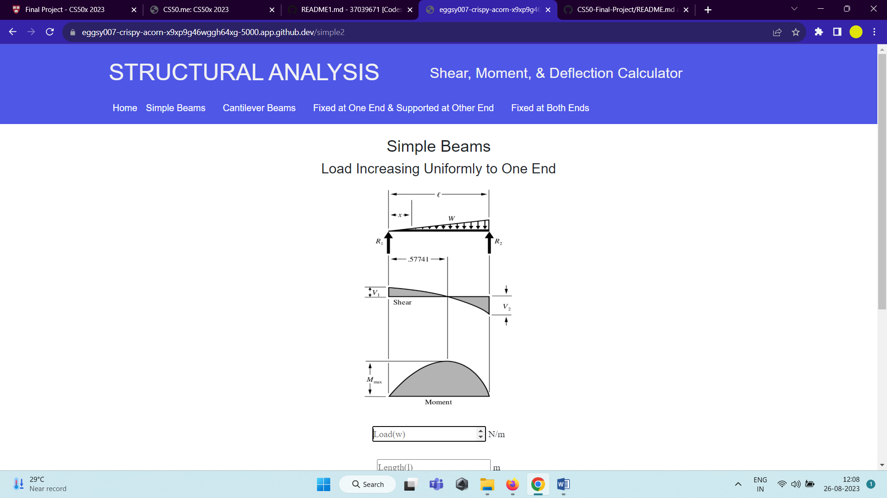

# Shear, Moment and Deflection Calculator

## CS50
>This was my final project for conclude the CS50 Introduction to Computer Sciense course.

>CS, python, flask, flask web framework, web development, CS50
## Features

- [Flask](https://flask.palletsprojects.com/en/1.1.x/)

I've used Flask web framework based in Python

## Overview

Welcome to the Shear, Moment, and Deflection Calculator project! This project showcases a user-friendly tool designed to simplify structural analysis for beams under various load scenarios. Developed by Tejas Gondane, a Masters's student at the Indian Institute of Technology, Guwahati, this calculator is a testament to the fusion of engineering principles and computer science.

## Explaining the project and the database
My final project is a website that allow the user to calculate shear, bending and deflection for different beams for different loading conditions.

### Python and flask:
I needed python and flask to make it more interactive:

The calculator is powered by Python and Flask, providing an interactive and seamless user experience. Python's versatility and Flask's web capabilities make structural analysis accessible and efficient.

## Pictures
- Homepage

| Homepage |
| :---: |
|  |

- Login and Adopt page

| Beams | Calculation |
| :---: | :---: |
|   | |

## Demonstration on youtube
**Video Demo:** Explore the calculator in action by watching the video demo [here](https://youtu.be/e2fJPSNaWb8).

## About CS50
CS50 is a openware course from Havard University and taught by David J. Malan

Introduction to the intellectual enterprises of computer science and the art of programming. This course teaches students how to think algorithmically and solve problems efficiently. Topics include abstraction, algorithms, data structures, encapsulation, resource management, security, and software engineering. Languages include C, Python, and SQL plus students’ choice of: HTML, CSS, and JavaScript (for web development).

Thank you for all CS50.

- Where I get CS50 course?
https://cs50.harvard.edu/x/2020/

#### Contribution

Contributions are welcome! If you find issues or have ideas for enhancements, feel free to open an issue or submit a pull request. Let's collaborate and make this tool even more valuable for the engineering community.

#### Acknowledgments

Special thanks to the CS50 course for inspiring this project and to the online community for their support and feedback.

#### Contact

Connect with Tejas Gondane:
- GitHub: [eggsy007](https://github.com/eggsy007)
- Email: tejas.gondane@email.com
- [LinkedIn Tejas Gondane](https://www.linkedin.com/in/tejas-gondane-06356817b/)

Embark on a journey into the world of structural analysis with the Shear, Moment, and Deflection Calculator. Gain insights, learn, and make your mark in the field of engineering. 🛠️🔗 #StructuralAnalysis #EngineeringInnovation